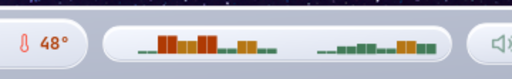
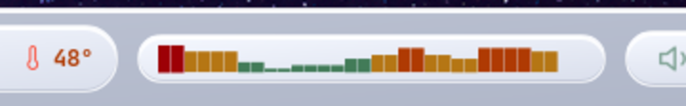

# eww-cavars · Visualizador CAVA para EWW

Visualizador de audio en tiempo real para barras de estado **EWW**. Lee el stream binario de CAVA, suaviza las amplitudes con EMA y renderiza barras LED skeuomórficas integradas en el pill glassmórfico de tu topbar.

<br>


<br>

---

## Capturas

| Estado activo | Señal intensa |
|:---:|:---:|
|  |  |

Las barras siguen la paleta **Gruvbox** del sistema: verde → ámbar → naranja → rojo según la amplitud de cada banda de frecuencia.

---

## Requisitos

| Herramienta | Versión mínima | Instalación (Arch) |
|---|---|---|
| [Rust](https://rustup.rs) | 1.70 | `rustup` |
| [CAVA](https://github.com/karlstav/cava) | 0.10 | `sudo pacman -S cava` |
| [EWW](https://github.com/elkowar/eww) | 0.6 | `yay -S eww` |
| PipeWire / PulseAudio | cualquiera | ya instalado |

---

## Instalación

### 1 · Clonar el repositorio

```bash
git clone https://github.com/tu-usuario/eww-cavars
cd eww-cavars
```

### 2 · Compilar e instalar el binario

```bash
cargo build --release
cp target/release/eww-cavars ~/.local/bin/eww-cavars
```

Comprueba que `~/.local/bin` está en tu `$PATH`:

```bash
echo $PATH | grep -o "$HOME/.local/bin" || echo 'export PATH="$HOME/.local/bin:$PATH"' >> ~/.bashrc
```

### 3 · Configurar CAVA

Copia el config incluido a tu directorio de CAVA:

```bash
cp config/eww.ini ~/.config/cava/eww.ini
```

<details>
<summary>Ver contenido del config</summary>

```ini
[general]
bars     = 16
framerate = 25
channels = mono

[input]
method = pulse
source = auto

[output]
method      = raw
raw_target  = /dev/stdout
channels    = mono
bit_format  = 16bit

[smoothing]
integral   = 60
monostereo = 0
```

</details>

> **¿Por qué 25 fps?**  Para una barra de estado es más que suficiente y reduce a la mitad los redraws GTK frente a los 60 fps por defecto de CAVA.

### 4 · Copiar el script de arranque

```bash
cp config/cava ~/.config/eww/scripts/cava
chmod +x ~/.config/eww/scripts/cava
```

El script contiene solo una línea:

```bash
exec cava -p "$HOME/.config/cava/eww.ini" | eww-cavars --eww --led
```

### 5 · Añadir el widget a EWW

**`eww.yuck`** — añade al principio del archivo (junto al resto de `deflisten`/`defpoll`):

```scheme
(deflisten cava_markup
  :initial "<span color='#c0bbb4'>▁▁▁▁▁▁▁▁▁▁▁▁▁▁▁▁▁▁▁▁▁▁▁▁▁▁▁▁▁▁▁▁</span>"
  "~/.config/eww/scripts/cava")

(defwidget w_cava []
  (box
    :class "cava-pill"
    :space-evenly false
    :valign "center"
    :halign "center"
    (label
      :class "cava-led-label"
      :halign "center"
      :valign "center"
      :markup cava_markup)))
```

Luego añade `(w_cava)` donde quieras en tu `bar_right` (o `bar_left` / `bar_center`):

```scheme
(defwidget bar_right []
  (box :space-evenly false :spacing 6 :halign "end" :valign "center"
    ; ... tus otros widgets ...
    (w_cava)       ; ← aquí
    (w_volume)
    (w_alerts)))
```

**`eww.css`** — añade `.cava-pill` al grupo de pills base y agrega los estilos al final:

```css
/* Añade .cava-pill al selector de pills existente */
.clock-pill,
.sys-pill,
.vol-pill,
.icon-pill,
.cava-pill,       /* ← añadir */
.logo-btn { ... }

/* Estilos específicos del módulo */
.cava-pill {
    min-width: 200px;
    padding: 4px 10px;
}

.cava-led-label {
    font-family: "JetBrainsMono Nerd Font", monospace;
    font-size: 11px;
    color: #c0bbb4;
}
```

### 6 · Recargar EWW

```bash
eww -c ~/.config/eww reload
```

El módulo aparece inmediatamente. Si usas música de fondo verás las barras reaccionar en tiempo real.

---

## Flags del binario

```
eww-cavars [FLAGS]

  --eww     Salida de texto plano (Pango Markup por línea).
            Necesario para EWW deflisten.
            Sin este flag, la salida es JSON para Waybar.

  --led     Paleta VU meter clásico (verde → ámbar → naranja → rojo).
            Sin este flag, usa la paleta de pywal (~/.cache/wal/colors.json)
            o el fallback de 8 colores incorporado.
```

---

## Personalización

### Cambiar framerate

Edita `~/.config/cava/eww.ini`:

```ini
[general]
framerate = 15   ; más suave en CPU — recomendado si tienes hardware antiguo
framerate = 25   ; equilibrio (valor por defecto)
framerate = 60   ; máxima fluidez
```

### Cambiar número de barras

El parámetro `bars` en el config de CAVA **debe coincidir** con `CHANNELS` en el código fuente:

```ini
; ~/.config/cava/eww.ini
[general]
bars = 8    ; menos barras, más anchas visualmente
```

```rust
// src/main.rs
const CHANNELS: usize = 8;  // ← mismo valor
```

Luego recompila: `cargo build --release && cp target/release/eww-cavars ~/.local/bin/`

### Cambiar paleta de colores

Sin `--led`, el binario carga automáticamente `~/.cache/wal/colors.json` (pywal).
Para un color fijo puedes editar `color_by_led()` en [`src/colorizer.rs`](src/colorizer.rs):

```rust
fn color_by_led(amp: f32) -> &'static str {
    if      amp < 0.45 { "#427b58" }   // ← tu verde
    else if amp < 0.70 { "#b57614" }   // ← tu ámbar
    else if amp < 0.88 { "#af3a03" }   // ← tu naranja
    else               { "#9d0006" }   // ← tu rojo pico
}
```

### Velocidad de suavizado

En `src/main.rs`:

```rust
const ALPHA_RISE: f32 = 0.75;   // 0.0–1.0 — más alto = respuesta más rápida
const GRAVITY:    f32 = 0.025;  // más bajo = caída más lenta (efecto VU largo)
```

---

## Solución de problemas

**El módulo no aparece / muestra `⚠ cava`**

```bash
# Verifica que CAVA está instalado
which cava

# Prueba el pipeline manualmente
cava -p ~/.config/cava/eww.ini | eww-cavars --eww --led | head -3

# Si el pipeline funciona, recarga EWW
eww -c ~/.config/eww reload
```

**Las barras no reaccionan al audio**

```bash
# Comprueba la fuente de audio de PulseAudio
pactl list sources short

# Edita eww.ini para apuntar a tu fuente
[input]
source = nombre_de_tu_fuente
```

**El módulo consume demasiada CPU**

Baja el framerate en `~/.config/cava/eww.ini` a `15` y recarga EWW.

---

## Detalles técnicos

### Arquitectura del pipeline

```
PulseAudio / PipeWire
        │
        ▼
    CAVA (C)
    ├─ FFT del audio en tiempo real
    ├─ 16 bandas de frecuencia, mono
    ├─ Salida: stream binario i16 LE por stdout
    └─ 25 fps → 25 frames/segundo

        │  pipe
        ▼

eww-cavars (Rust)
    ├─ cava.rs      — lee frames i16 LE del stdin
    ├─ smoother.rs  — EMA en subida, gravedad lineal en bajada
    ├─ mapper.rs    — amplitud [0.0, 1.0] → glifo Unicode (▁▂▃▄▅▆▇█)
    ├─ colorizer.rs — glifo + amplitud → Pango Markup coloreado
    └─ output.rs    — máquina de estados (Active / Silent / Muted)
                      salida: JSON (Waybar) o texto plano (EWW)

        │  stdout, 1 línea por frame
        ▼

EWW (deflisten)
    └─ actualiza cava_markup → re-renderiza el label GTK
```

### Algoritmo de suavizado

Cada canal se suaviza de forma independiente combinando dos comportamientos:

- **Subida** — EMA con α configurable (por defecto 0.75): respuesta rápida a los transitorios.
- **Bajada** — Gravedad lineal (por defecto 0.025/frame): caída suave que imita un VU meter analógico con retención de pico.

```
si raw > suavizado:  suavizado += α × (raw − suavizado)   ← sube rápido
si raw ≤ suavizado:  suavizado  = max(suavizado − g, 0)   ← cae lento
```

### Uso de recursos (medido en Arch Linux / Hyprland)

| Proceso | CPU | RAM |
|---|---|---|
| `cava` (25 fps, 16 barras) | ~0–1% | < 2 MB |
| `eww-cavars` | < 0.1% | < 1 MB |
| `eww` (barra completa) | ~1–2% | ~15 MB |

El binario Rust no realiza ninguna reserva de memoria dinámica en el hot path (loop principal). El estado interno del suavizador y el buffer de lectura se inicializan una sola vez.

### Modos de color disponibles

| Flag | Modo | Descripción |
|---|---|---|
| `--led` | `Led` | Verde→ámbar→naranja→rojo por amplitud. Paleta Gruvbox. |
| _(ninguno)_ | `ByAmplitude` | Paleta de pywal (`~/.cache/wal/colors.json`) o fallback de 8 colores. |
| _(código)_ | `ByPosition` | Degradado espectral horizontal (graves → agudos). |
| _(código)_ | `Flat` | Color fijo único para todos los glifos. |

### Estructura del proyecto

```
eww-cavars/
├── src/
│   ├── main.rs        — entrada, flags CLI, loop principal
│   ├── cava.rs        — lector de stream binario CAVA (i16/f32 LE)
│   ├── smoother.rs    — suavizado EMA + gravedad por canal
│   ├── mapper.rs      — amplitud → glifo Unicode, layout compacto/espaciado
│   ├── colorizer.rs   — Pango Markup, paletas de color, estados especiales
│   └── output.rs      — máquina de estados, salida JSON/texto
├── config/
│   ├── eww.ini        — configuración CAVA para EWW (16 barras, 25 fps, mono)
│   └── cava           — script de arranque para deflisten
├── assets/
│   ├── topbar-full.png
│   ├── cava-active.png
│   └── cava-silent.png
└── Cargo.toml

```

---

<sub>Probado en Arch Linux · Hyprland · EWW 0.6 · CAVA 0.10 · PipeWire</sub>
